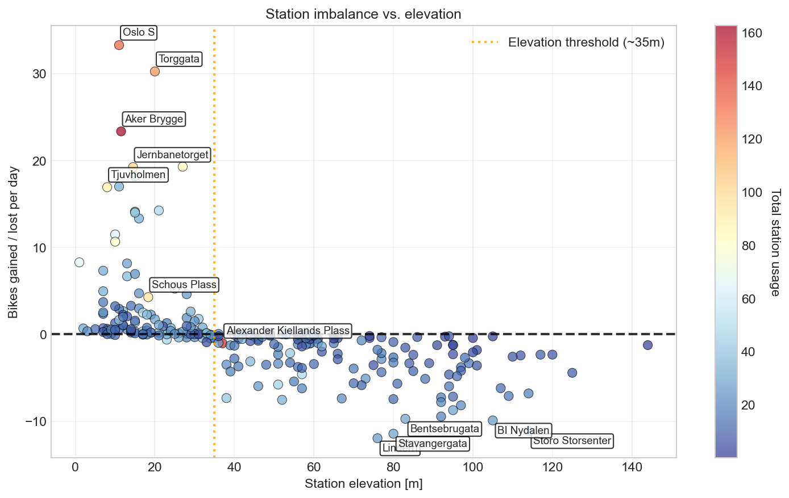

# Project Gradient: Understanding Oslo's Bike Sharing System
**Insights from geography, network structure, and time-based patterns**

## Overview
Oslo's bike-sharing system **Bysykkel** is a popular and practical way to get around the city. As a frequent user, I noticed how bikes often accumulate downtown, and that pattern sparked my curiosity. Since Bysykkel publishes historical ride data, I set out to explore what these data could reveal. In this project, I investigate how **topography, network structure**, and **temporal patterns** influence the system, and what it takes to keep it balanced and useful.

**Data Source:** [Oslo Bysykkel Historical Data](https://oslobysykkel.no/apne-data/historisk) (using all data from **2024**)  
  
This dataset contains records of all historical bysykkel rides in 2024. Each row represents one ride and includes details on start and end stations, timestamps, and coordinates. The analysis is structured in three phases:
1. **Topographical flow analysis**  
2. **Network structure analysis**  
3. **Temporal pattern analysis**

[View complete analysis here!](notebooks/analysis.ipynb)

## Analysis highlights
### The network at a glance

 
<em>Oslo's bike network showing station types and most frequent routes. Green stations import bikes, red stations export them. Line thickness indicates route popularity.</em>
  

The network visualization reveals Oslo's bike-sharing system has a **dual-zone structure**: A dense core of interconnected stations in central Oslo that consistently accumulate bikes, surrounded by peripheral stations that primarily export bikes downhill into the city center. This flow of bikes isn't random but caused by Oslo's topography, as proven below.

 
<em>Net bike gain / loss per station as a function of elevation. Stations above ~35m consistently export bikes while those below import them.</em>
  

The relationship between station elevation and bike flow is striking. It is clear that **elevation determines bike flow**. Oslo's natural gradient creates a downhill tendency where cyclists prefer riding from higher elevations down to the city center, while taking other means of transportation back home. This results in bikes accumulating downtown and a shortage of bikes in peripheral areas. 

## Key findings

 
<em>Hourly bike flow patterns for extreme importer and exporter stations show when these stations create challenges throughout the day. Importer stations (green) consistently accumulate bikes, while exporters (red) consistently lose them</em>
  

The temporal analysis shows that the geographic patterns discovered above cause predictable operational challenges. Importer stations (green lines) show strong morning and afternoon peaks as bikes flow into central Oslo, while exporter stations (red lines) consistently lose bikes with no evening return flow. This confirms that people don't bike back uphill.

**Key discoveries from this analysis:**
- **Gravity drives the system:** 59.6% of trips go downhill vs. 38.8% uphill, creating strong imbalances in the system.
- **Elevation threshold:** Stations above ~35m export bikes daily, those below import them (correlation = -0.55)
- **Weekday dominance:** Weekday trips are 37% more frequent than weekend trips. The system is primarily used for commuting. 
- **Strong rush hour pattern:** Morning exports and afternoon imports create time-specific rebalancing needs. 
- **Identified critical stations:** Top 20 stations (7.7% of network) require moving 302 bikes daily as minimum rebalancing operation.
- **Two-zone network:** Dense central core acts as bike sink, peripheral stations act as feeders. 

## Technologies used
- **Data processing:** Python, pandas, DuckDB for handling 1M+ trip records
- **Analysis:** NetworkX for network analysis
- **Visualization:** matplotlib/seaborn for charts, Folium for interactive maps
- **Environment:** Jupyter Notebooks, Git/GitHub

**Data Source:** [Oslo Bysykkel Historical Data](https://oslobysykkel.no/apne-data/historisk)

## About me
As a data scientist, this deep-dive into Oslo's bike network proved to be a complete rabbit hole. This might not be the end of this analysis ;)

**Harald Thommesen**  
[harald.thommesen@outlook.com](mailto:harald.thommesen@outlook.com)  
[LinkedIn](https://www.linkedin.com/in/h-thommesen/)